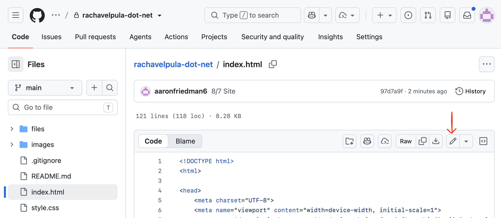
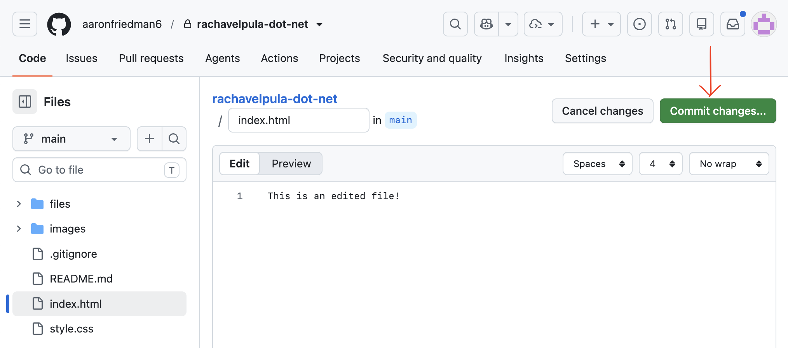
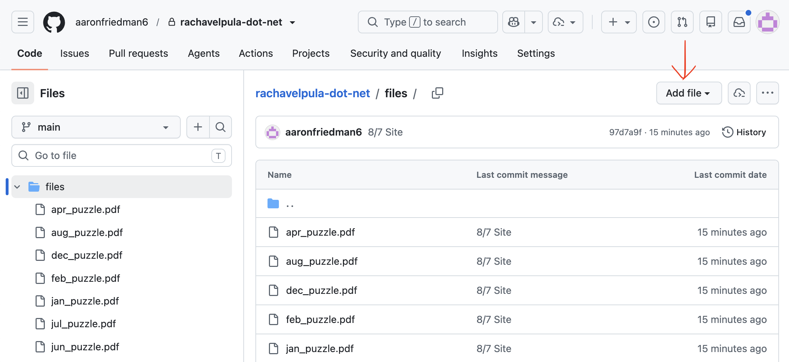

## Exploring your website
```
.
├── .github/workflows (a)
│   └── ...
├── files (1)
│   └── ...
├── images (b)
│   └── ...
├── readme-images (c)
│   └── ...
├── .gitignore (d)
├── README.md (e)
├── index.html (2)
├── sitemap.xml (f)
└── style.css (3)
```

#### Files you should care about
* (1) This folder contains all of the PDFs that visitors to your website can view
* (2) This is the content file. It determines *what* is displayed on your website.
* (3) This is the styling file. It controls *how* things are displayed on your wesbite.

#### Files you should NOT care about
* (a) This folder contains the code to make your changes appear on the live website
* (b) This folder contains all of the images that appear on your website. However, they all need to be reduced to the proper size before uploading, so please don't touch this without checking.
* (c) This folder contains all of the images that appear on this instructions page
* (d) This file instructs GitHub to ignore certain files
* (e) This file contains these instructions
* (f) This file is required so that your website shows up on Google search results

## How to make changes to your website
#### Updating `index.html` or `style.css`
1. Click on the name of the file and then the pencil icon here: 
2. Make your edits
3. Click "Commit changes..." here: 
4. Under "Commit message" write a description of what you changed
    * Other than the "Commit message" field, nothing else needs to be touched: The "Commit directly to the `main` branch" option should be selected by default
5. Click the "Commit changes" button
6. Refresh https://www.rachavelupla.net and make sure your changes appear

#### Updating a PDF
1. Click on the `files` folder
2. Click on the "Add file" button here: 
3. Click the "Upload files" option. Make sure the new PDF has the same exact name as the old PDF!
3. Follow steps 4 through 6 above